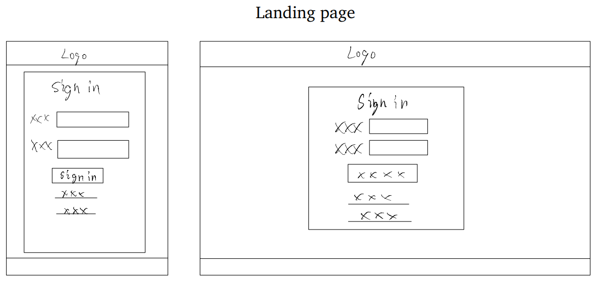

# Web Application Topic : A Brand Web Shop

#### *PS: The information below might change during the progress of the project. This text is just to briefly describe the project make it more real.* 

## Introduction

In this project, the developer will provide a web application as a platform that can help the client to introduce their brand and product and sell their products. 

## Team

This is an Individual Project, S.Zhu ( 3992616 ) will represent the Client and developer at the same time.

## Current situation

The client is a first-year ICT student at Fontys. He wants to create a reliable webshop to help him to sell their products in the future, which means he does have an idea about the products, but he doesn't have the actual product yet. In this case, the developer will dig into more specific questions about his plan, then provide an appropriate solution for him.

## Problem Description

The client would like to have a solution that can balance the requirement from the school and their own needs. Base on the limitation of knowledge and time from school, the client wants the developer to provide a web application draft version mainly focus on :

- Usability of the webpage 
- User management
- Product selling

## Project Goal

There are two main goal for client/developer:

- Fulfil the requirement form school
- Build build a useable solution for client future use

---

## Use case diagram

## User Requirement

- Customer can browser Client's brand and product information.
- Customer can order product through third-party’s payment API (e.g iDeal, PayPal)
- Customer can register a account with their E-mail.
- Customer can check their product status.
- ...

## Wireframe

**Desktop Version**

- Landing Page

  

- Register  Page

  

- Main page

  

- Product info page

  

- Shopping cart

  

- Checkout page

  

- Personal Account manage page(tracking order/reviewed for product/setting )

  

## Database Modelling

